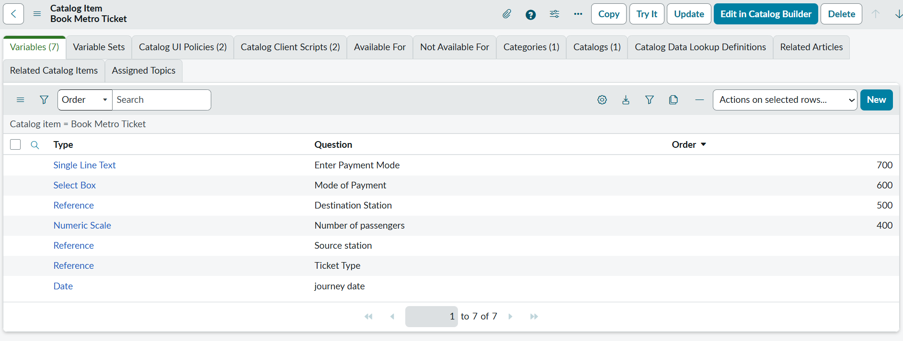

# metro-ticket-generating-system
**Book Metro Ticket** is a ServiceNow Service Catalog application that enables users to book metro tickets through a self-service portal. It uses Catalog Variables, UI Policies, Client Scripts, and Flow Designer to validate inputs, automate booking requests, and provide a seamless, user-friendly ticket booking experience.

## 📸 Project Screenshots

### 1. Application Created

### 2. Metro Station Table

### 3. Metro Route Table

### 4. Fare Rule Table

### 5. Metro Ticket Request Table

### 6. Ticket Type Table

### 7. Catalog Item

### 8. Variables

### 9. Catalog UI Policy

### 10. Catalog Client Script

### 11. Validation Script

### 12. Flow Designer

### 13. Executing Flow

### 14. Service Portal

### 15. Ticket Booking

---
